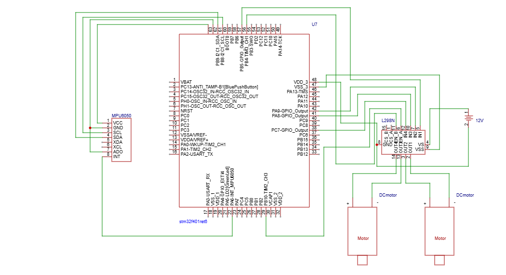

# Self-balancing Robot using STM32F4 

Project made to improve understandig of filters (Kalman filter and complementary filter) and PID control of motors

## Demo

- Working Video
https://youtube.com/shorts/rS4vTKlr358
- PID Controller user menu usingOLED and encoder https://youtube.com/shorts/RhKpqrFH3e4

## Features

-Chasis designed in Fusion360 and 3d printed using PLA
-I2C comunication.  OLED screen and MPU6050 on the same bus
-User interface for calibrating PID controller
-Using Kalman Filter or Complementary Filter to make sure data is reliable

## Components

- Nucleo STM32F401RE 
- L298N Driver
- MPU 6050 Gyro
- DC motors
- IDUINO encoder (not conncted yet)
- OLED Screen with SSH1106 (not conncted yet)
- Battery Pack

## Electrical Scheme

